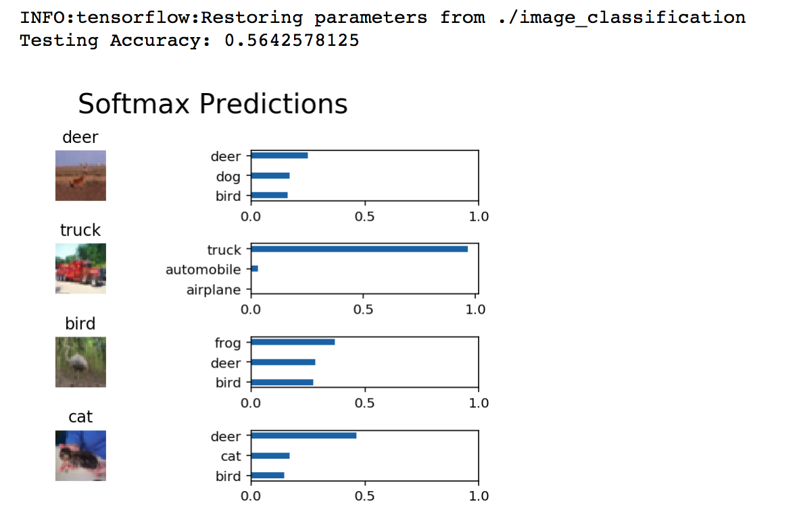

# image-classification

**Image Classification using Convolutional Neural Networks (CNNs)**  

**Summary**  
Classified images from the CIFAR-10 dataset using maxpool and dropout techniques, validation accuracy = 0.60  
  
Please see detail in python [notebook](./dlnd_image_classification.ipynb) (.ipynb)  
  
**Sample Results:**  
  
